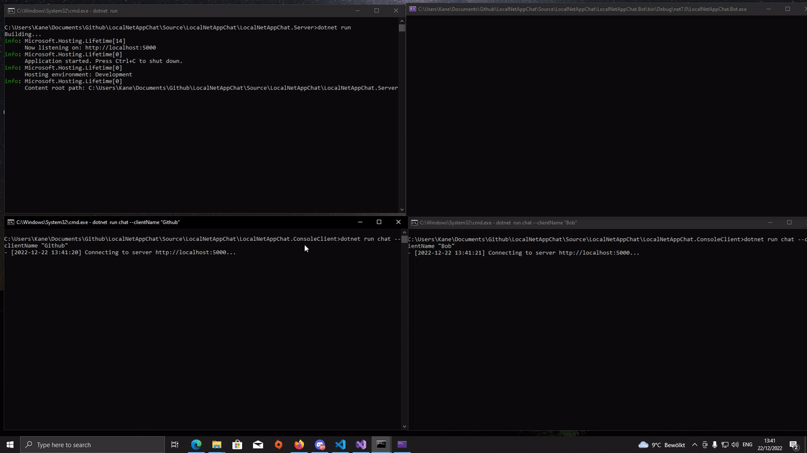

# LocalNetAppChat

LocalNetAppChat (LNAC) is a server/client C# command line interface that gives your apps a way to communicate with each other over the local network.

<!-- TOC -->

- [Vision](#vision)
- [Features](#features)
- [Usage](#usage)
  - [Server CLI](./docs/Server/README.md)
  - [Client CLI](./docs/Client/README.md)
  - [Bot CLI](./docs/Bot/README.md)
- [Installation](#installation)
  - [Server](#server)
  - [Client](#client)
  - [Bot](#bot)
- [Contributions](#contributions)
- [Questions?](#questions?)

<!-- /TOC -->

## Vision

LNAC is focusing on giving you a central service with which you can easily group computers together.

Without the need of programming skills, it gives you a server that supports text messaging and a central file storage, as well as a standard client and a bot that will enable a bunch of scripts to come to life over the net. A bit like a remote shell. But since all clients are connected to the server it enables the computers to also communicate around network borders. You, as a person, can take part in this chat using the client in chat mode, so you can see and debug and issue commands as you like.

The focus usage points at the moment are:

- Collecting execution log information (sending messages that can be reviewed by a human)
- Sending commands to bots either direct or as a broadcast and receiving their results
- Exchanging files between the computers that take part.

It should be reasonably secure to use in a trusted local network.

Usage Scenarios include:

- [CI/CD-Pipeline](./docs/usage-cicd-pipeline.md)
- [Central Log](./docs/usage-central-log.md)

## Features

- Available for Windows, Linux and macOS
- Easy to use
- Adds a few simple entry points / command line tools that enable network communication between a group of hosts and sub applications.
- Ability to execute and run tasks between your local apps through command line over the network
- Encrypted communication
- and more

## Showcase

## Installation

### Server

To start using LNAC, you have to install the LNAC Server on your host machine, which will be responsible for handling the communication between your clients. You can download the server from the [Release Page](https://github.com/stho32/LocalNetAppChat/releases) for your preferred operating system.

### Client

The client app is responsible for sending messages to other clients and receiving new updates/messages from the server. You can download the client from the [Release Page](https://github.com/stho32/LocalNetAppChat/releases) as well.

### Bot

The LNAC Bot behaves like a listener and gets the messages from the server. If one of the messages that the clients have sent includes one of the bot commands, it will perform an operation accordingly, for example, if a client sent `/ping`, the bot will send a message to the server including the following: `responding to ping from {clientName} ==> a very dear pong from " + botName`.

To install the bot, simply download it from the [Release Page](https://github.com/stho32/LocalNetAppChat/releases).

## Contributions

Software contributions are welcome. If you are not a dev, testing and reporting bugs can also be very helpful!

## Questions?

Please open an issue if you have questions, wish to request a feature, etc.
