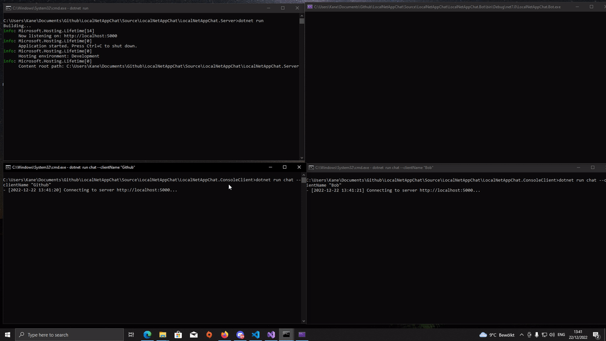

# LocalNetAppChat

[](https://github.com/CleverCodeCravers/LocalNetAppChat/actions/workflows/ci.yml)
[](https://coveralls.io/github/CleverCodeCravers/LocalNetAppChat?branch=main)

**Zero-Config .NET LAN Automation** -- a lightweight server/client C# tool that gives your apps a way to communicate, execute scripts, and share files across your local network. No Docker, no SSH, no complex setup -- just download and run.

## Why LNAC?

Unlike Ansible (requires SSH), Rundeck (requires a web server), or NATS (requires infrastructure knowledge), LNAC is designed for **zero-config simplicity**:

-   **Single binary** -- one `lnac` executable for server, client, and bot
-   **No agents to install** -- clients connect to a central server via HTTP
-   **No infrastructure needed** -- no Docker, no databases, no message brokers
-   **.NET native** -- integrates naturally with C#/.NET ecosystems
-   **Cross-platform** -- Windows, Linux, macOS

Perfect for small teams, lab environments, build farms, or anyone who needs lightweight automation without the overhead of enterprise tools.

## Quick Start

```bash
# 1. Start the server
lnac server --key "MySecretKey"

# 2. Send a message from another machine
lnac message --server 192.168.1.10 --key "MySecretKey" --text "Build complete"

# 3. Listen for messages
lnac listener --server 192.168.1.10 --key "MySecretKey" --clientName "Monitor"

# 4. Interactive chat
lnac chat --server 192.168.1.10 --key "MySecretKey"

# 5. Start a bot for remote script execution
lnac bot --server 192.168.1.10 --key "MySecretKey" --scriptspath ./scripts
```

## Features

-   **Cross-platform** -- Windows, Linux, macOS
-   **Task System** -- Distribute work across multiple clients with tag-based routing
-   **Direct Messaging** -- Send messages to specific clients using `/msg ClientName`
-   **File Storage** -- Central file repository accessible by all clients
-   **Bot Plugin System** -- Execute PowerShell/Python scripts remotely
-   **Emitter Mode** -- Stream command output line-by-line in real-time
-   **Duplicate Prevention** -- Messages with same ID are rejected within 1 hour
-   **Comprehensive Logging** -- Daily rotating logs with Serilog integration
-   **Rate Limiting** -- Built-in protection against abuse (100 req/min per IP)
-   **HTTPS support** -- Optional TLS encryption via `--https` flag
-   **API Key Authentication** -- Via `X-API-Key` header or `--key` parameter

## Showcase



## Installation

Download `lnac` for your platform from the [Release Page](https://github.com/CleverCodeCravers/LocalNetAppChat/releases).

Available: `lnac-linux-x64.zip`, `lnac-win-x64.zip`

Run `lnac --help` for a list of all commands, or `lnac <command> --help` for command-specific options.

## Usage Scenarios

-   [CI/CD-Pipeline](./docs/usage-cicd-pipeline.md)
-   [Central Log](./docs/usage-central-log.md)
-   [Math Calculation Bots](./docs/scenarios/math-bots/README.md)
-   [Distributed Build System](./docs/scenarios/distributed-build/README.md)
-   [Monitoring & Alerting](./docs/scenarios/monitoring-alerting/README.md)
-   [File Sync & Backup](./docs/scenarios/file-sync/README.md)
-   [More Scenarios...](./docs/scenarios/README.md)

## Development

```bash
# Build
cd Source/LocalNetAppChat
dotnet build

# Test
dotnet test

# Or use the build script
./build.ps1 build
./build.ps1 test
./build.ps1 publish
```

## Contributions

Software contributions are welcome. If you are not a dev, testing and reporting bugs can also be very helpful!

## Questions?

Please open an issue if you have questions, wish to request a feature, etc.

## License

[MIT](./LICENSE)
